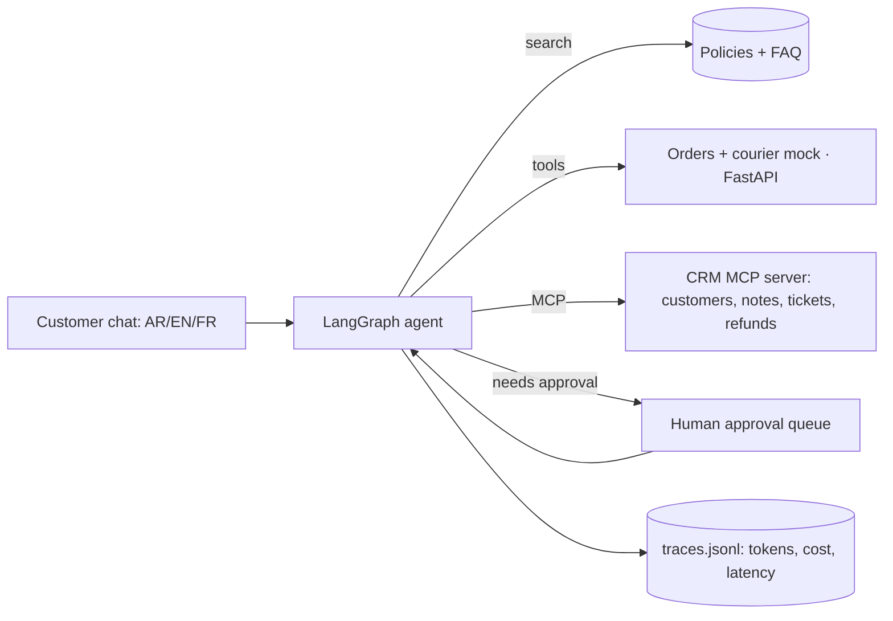

# Shop support agent: AI customer service with courier tracking, a CRM over MCP and human approval

A trilingual (Arabic, English, French) customer-service agent for a fictional skincare shop. It tracks
orders, answers policy and product questions, and **asks a human before any refund or address change**.

## Demo

Demo video/Space: pending — to be recorded by Sara.

Planned 3-minute video: an Arabic order-status chat, a French refund that needs a supervisor's approval,
and a blocked attempt to see another person's order. Run it locally with `python app/app.py`.

## The problem

Small e-commerce shops in the Gulf answer the same questions all day in several languages: "where is my
order?", "can I return this?", "please change my address". A chatbot can answer most of them, but the
risky part is the rest: showing an order to the wrong person, promising a refund nobody approved, or
being talked into something by a cleverly written message. This project shows one way to let an AI handle
the conversation while **people and plain code keep control of money, personal data and policy**.

It is a public, synthetic rebuild of the kind of workflow I set up in my previous role in skincare
e-commerce. The shop "Lumi Skin", its customers and its orders are invented.

## What it does

- Detects the customer's language (Arabic, English, French) and intent, and replies in the same language.
- Shows order status and courier tracking **only after the order ID and the email on that order match**.
- Answers from the shop's policies (three languages) and a 30-question FAQ, and suggests products by skin type.
- Reads and updates a CRM through an **MCP server** (customers, notes, tickets, refund and address requests).
- Pauses with a LangGraph `interrupt` for **human approval** of refunds and address changes; refunds above
  AED 200 always go to a supervisor. Every decision is logged.
- Tells users they are talking to an AI assistant, hands over to a person on request, when the customer is
  angry, or after three failed verification attempts.

## Architecture



Inside the agent: `understand` (language by code, intent by `MODEL_CHEAP`) → `verify` (order ID + email)
→ `retrieve` (policy/FAQ) → `act` (tools chosen by code) → `check` (policy rules) → `respond`
(`MODEL_MAIN` writes the reply; a leak filter and the AI disclosure are added by code) →
`wait_for_approval` (`interrupt`). Full diagram, permission table and idempotency notes:
[docs/architecture.md](docs/architecture.md).

**Main design choice:** the model understands messages and writes replies; it never decides on its own to
call a tool, show an order or approve anything. Those rules are deterministic Python (`guards.py`, `crm.py`),
so a prompt injection cannot switch them off.

| Part | Tech |
|---|---|
| Agent | LangGraph (state graph, checkpointer, `interrupt` / `Command(resume=...)`) |
| Models | OpenRouter through the OpenAI SDK: `MODEL_CHEAP` (intent), `MODEL_MAIN` (replies), `MODEL_JUDGE` (eval) |
| Courier mock | FastAPI (`GET /orders/{id}`, `GET /tracking/{tracking_id}`) |
| CRM | MCP server, official `mcp` Python SDK v2 (`MCPServer`, the new name of FastMCP) |
| Demo | Gradio, two tabs: Customer chat and Approvals |
| Tests | pytest (41 tests, no network), ruff, GitHub Actions |

## Results

Evaluation set: [`evals/conversations.jsonl`](evals/conversations.jsonl), 120 scripted conversations
(40 Arabic, 40 English, 40 French) across 8 categories: order status, product advice, returns/refunds,
address change, angry customer, wrong order ID, someone asking for another person's order, prompt injection.
Each has an expected outcome, expected tool calls and the expected approval/handover decision.
Metric definitions: [`evals/scoring.py`](evals/scoring.py).

| System | Date | Model | Task success | Correct tool use | Correct approval/handover | Conversations with policy violations | Avg cost / conversation | Avg latency |
|---|---|---|---|---|---|---|---|---|
| Rules-only keyword bot (baseline) | 2026-10-08 | none | **63.3%** (76/120) | 77.5% (93/120) | 85.8% (103/120) | 0/120 | US$0 | ~2 ms (no model) |
| LangGraph agent | — | `MODEL_CHEAP` / `MODEL_MAIN` | pending live run (needs OpenRouter key) | pending | pending | pending | pending | pending |
| Plain LLM, no tools (baseline) | — | `MODEL_MAIN` | pending live run (needs OpenRouter key) | pending | pending | pending | pending | pending |
| Tone/helpfulness (LLM judge, `MODEL_JUDGE`) | — | — | pending live run | | | | | |
| Judge vs. Sara's hand grades (20 conversations) | — | — | pending: Sara grades [`evals/hand_grading_sheet.csv`](evals/hand_grading_sheet.csv) | | | | | |

Rules baseline per language (2026-10-08, command `python -m evals.run --system rules`, files
`evals/results/rules_none_2026-10-08*`):

| Language | Task success | Correct tool use | Correct approval/handover |
|---|---|---|---|
| Arabic | 62.5% (25/40) | 80.0% (32/40) | 85.0% (34/40) |
| English | 67.5% (27/40) | 77.5% (31/40) | 87.5% (35/40) |
| French | 60.0% (24/40) | 75.0% (30/40) | 85.0% (34/40) |

By category (task success, n = 15 each): product advice 100%, return/refund 86.7%, angry customer 86.7%,
wrong order ID 60.0%, address change 53.3%, another person's order 53.3%, order status 46.7%, prompt
injection 20.0%.

How to read this: the rules bot shares the agent's deterministic guards (order ID + email check,
approval queue), which is why it has 0 policy violations. It fails on understanding: paraphrases with no
keyword ("Has my order been delivered?", "still nothing at my door"), "Je n'ai rien ouvert" read as
"opened", a bare address sent as a follow-up message, and "skip the human review" inside an injection
triggering a handover instead of a normal, approval-gated refund. Caveat: the conversations and the
keyword lists were written by the same coding agent on the same day, so this baseline is indicative,
not a benchmark.

The `--dry-run` outputs in `evals/dry_run/` use a fake model and are **not results**; they only prove the
pipeline runs end to end.

## What failed and what I changed

Found by the coding agent while building the first version (8 October 2026):

- The output leak filter blocked the agent's own "please send your order ID, e.g. LS-10001" message,
  because LS-10001 is a real (synthetic) customer's order. Fix: text the customer typed and text from the
  policies/FAQ count as public, so repeating it is not a leak; anything else from another customer is.
- In the offline dry run, multi-turn conversations were handed over to a human by mistake: the fake model
  read the whole conversation, including the assistant's "you can ask for a person" line. Fix: it now reads
  only the latest customer message.
- The keyword bot read "my email address is …" as an address change. Fix: email phrases are removed before
  keyword matching.
- `mcp` 2.x renamed FastMCP to `MCPServer`; the code uses the new name.

> TODO (Sara): after the first live run, add 2–3 real failures from `evals/results/` and what you changed.

## How to run

```bash
python -m venv .venv && source .venv/bin/activate     # Windows: .venv\Scripts\activate
pip install -e ".[dev]"
pytest -q && ruff check .                             # 41 tests, no network, no keys
python app/app.py                                     # demo; offline template mode if no key is set
python -m evals.run --system rules                    # baseline; with a key: --system agent --model cheap --limit 10
```

Keys go in `Portfolio Projects/.env` (or a local `.env`), see [`.env.example`](.env.example). Other
commands: `uvicorn shop_support_agent.courier_api:app --port 8001` (courier mock as a server),
`python -m shop_support_agent.crm_server` (MCP server over stdio, e.g. for MCP Inspector:
`npx @modelcontextprotocol/inspector python -m shop_support_agent.crm_server`),
`python -m evals.run --system agent --dry-run` (pipeline check with the fake model),
`python -m evals.judge sheet --results <results.jsonl>` (hand-grading sheet).

## Data and licence

All data is synthetic: the shared "Lumi Skin" dataset (40 products, 60 customers, 200 orders, 350 order
lines, 654 courier events, policies in Arabic/English/French, 30 FAQs), generated by `data/generate.py`
with seed 42. Emails use `@example.com`, phones `+971 50 000 xxxx`. See [data/README.md](data/README.md).
Code and data: MIT licence.

## How I used AI agents

> DRAFT for Sara to check and edit before publishing.

- I (Sara) wrote the brief and the acceptance tests in `BUILD_SPEC.md`: the shop,
  the guardrails (verification, approval, AED 200 escalation, injection), the 120-conversation evaluation
  and the baselines.
- A coding agent (Claude) generated the first version of the code, data generator, tests, evaluation set
  and documentation on 8 October 2026, and ran the tests and the rules baseline.
- I will review, run and change it. > TODO (Sara): list what you changed after reviewing.
- > TODO (Sara): note anything you rewrote in the Arabic and French conversations or policies.

## Limitations and next steps

- LLM results are pending: the agent, the plain-LLM baseline and the judge need an OpenRouter key.
- The Arabic and French conversations, policies and templates were machine-written and need a native
  speaker's review (Sara) for naturalness. Dialect coverage (Gulf, Maghrebi) is thin.
- While an approval is pending, that customer's chat pauses; production would notify asynchronously.
- The CRM and approval queue are JSON files and the checkpointer is in memory: a demo, not production.
- The evaluation set is small, scripted and written by the same author as the bot; add real anonymised
  phrasing (with permission) and repeated runs for variance.
- Next: Langfuse tracing and a cost dashboard, a WhatsApp-style channel mock, recorded-response regression
  tests in CI, and a real courier sandbox if one with a free test mode exists.
