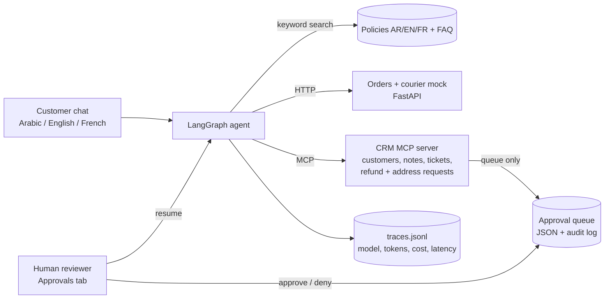
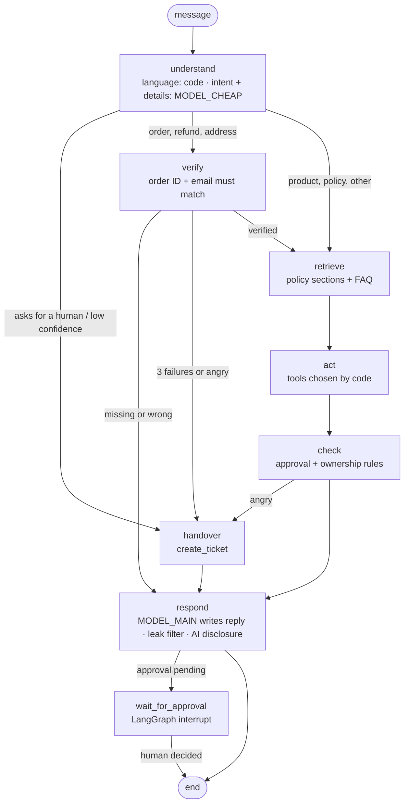

# Architecture

## System

## Agent graph (one run per customer message)

## Components

| Component | File | What it does |
|---|---|---|
| Agent graph | `src/shop_support_agent/agent.py` | LangGraph `StateGraph` with an in-memory checkpointer (one thread per conversation). |
| Guardrails | `src/shop_support_agent/guards.py`, `crm.py` | Verification, approval levels, leak filter, AI disclosure. Plain Python, not prompts. |
| Courier mock | `src/shop_support_agent/courier_api.py` | FastAPI: `GET /orders/{id}`, `GET /tracking/{tracking_id}`. Client retries 5xx and network errors. |
| CRM MCP server | `src/shop_support_agent/crm_server.py` | `MCPServer` (the v2 name of FastMCP) with 5 tools. The agent calls it through a real MCP client in-process. |
| Knowledge | `src/shop_support_agent/knowledge.py` | Same 9 numbered sections in each policy language, so one topic map works for AR/EN/FR. |
| LLM client | `src/shop_support_agent/llm.py` | OpenRouter via the OpenAI SDK; `FakeLLM` for tests, dry runs and the offline demo; traces. |
| Demo | `app/app.py` | Gradio: Customer chat tab + Approvals tab. |
| Evaluation | `evals/` | 120 scripted conversations, scoring, rules baseline, plain-LLM baseline, LLM judge. |

## Permission table

| Action | Who can trigger it | Needs | Applied by |
|---|---|---|---|
| Show order status / tracking | Agent | Order ID + email on that order match | Read only |
| Product advice, policy answers | Agent | Nothing | Read only |
| `add_note`, `create_ticket` | Agent | Nothing (internal, no customer impact) | CRM immediately |
| `request_refund` (≤ AED 200) | Agent queues it | Verified customer, eligible return | A team member in the Approvals tab |
| `request_refund` (> AED 200) | Agent queues it | Same | A **supervisor** only |
| `update_address` | Agent queues it | Verified customer, order still `processing` | A team member |

The model can never move an action to "approved": only `CrmStore.decide()` does that, and only the
Approvals tab calls it.

## Idempotency (why a retry never pays twice)

- `request_refund` / `update_address` refuse to queue a second pending item for the same order and action.
- `decide()` does nothing if the item is already decided, so a double click does not create two refunds.
- LangGraph re-runs a node from its start when it resumes after `interrupt()`. So `wait_for_approval`
  has **no side effects before** `interrupt()`; queuing happens earlier in `act`, and the decision is
  applied by `decide()` before the graph is resumed.

## Known limitations of this design

- While an approval is pending, the chat for that customer is paused (the app answers "waiting for review").
  A production version would let the customer keep chatting and notify them asynchronously.
- The courier API trusts its caller; identity is checked in the agent before the API is called.
- The CRM and approval queue are JSON files: fine for a demo, not for concurrent production use.
